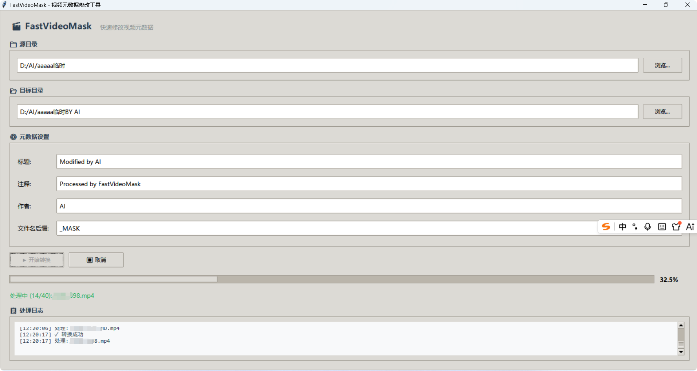

# FastVideoMask

<p align="center">
  <strong>快速批量修改视频元数据的 Windows 桌面工具</strong>
</p>

<p align="center">
  
  
  
</p>

<p align="center">
  <a href="#功能特性">功能特性</a> •
  <a href="#安装">安装</a> •
  <a href="#使用方法">使用方法</a> •
  <a href="#技术栈">技术栈</a> •
  <a href="#贡献">贡献</a>
</p>

---

## 功能特性

- **批量处理** - 递归扫描源目录下所有视频文件，一键批量处理
- **元数据修改** - 支持修改视频标题、注释、作者等元数据信息
- **无损处理** - 使用 FFmpeg 流复制模式，不重新编码，处理速度快且无损
- **目录结构保持** - 输出文件保持原有目录结构
- **文件名自定义** - 可自定义输出文件名后缀
- **实时进度** - 显示处理进度和详细日志
- **支持取消** - 处理过程中可随时取消，已处理文件保留
- **现代化界面** - 简洁美观的 GUI 界面

## 支持的视频格式

| 格式 | 扩展名 |
|------|--------|
| MP4 | .mp4, .m4v |
| AVI | .avi |
| MKV | .mkv |
| MOV | .mov |
| WMV | .wmv |
| FLV | .flv |
| WebM | .webm |
| MPEG | .mpeg, .mpg |
| 3GP | .3gp |
| Transport Stream | .ts, .mts, .m2ts |

## 截图

<!-- 请在截图后替换下方占位符 -->
<p align="center">
  
</p>

## 安装

### 前置要求

- **Python 3.8+**
- **FFmpeg** - 需要安装并添加到系统 PATH 环境变量

### 安装 FFmpeg

#### Windows (推荐使用 Winget)

```bash
winget install FFmpeg
```

#### 或手动安装

1. 从 [FFmpeg 官网](https://ffmpeg.org/download.html) 下载 Windows 版本
2. 解压到任意目录（如 `C:\ffmpeg`）
3. 将 `C:\ffmpeg\bin` 添加到系统 PATH 环境变量

### 方式一：直接运行源码

```bash
# 克隆仓库
git clone https://github.com/yourusername/FastVideoMask.git
cd FastVideoMask

# 运行程序
python main.py
```

### 方式二：打包为 EXE

```bash
# 运行打包脚本
build.bat

# 生成的 EXE 文件位于 dist 目录
```

## 使用方法

1. **选择源目录** - 点击"浏览"选择包含视频文件的目录
2. **选择目标目录** - 选择处理后文件的输出目录
3. **配置元数据** - 设置要修改的标题、注释、作者等信息
4. **设置文件名后缀** - 默认为 `_MASK`，可根据需要修改
5. **开始转换** - 点击"开始转换"按钮，等待处理完成
6. **查看日志** - 在日志区域查看处理进度和结果

## 技术栈

- **Python 3** - 主要编程语言
- **Tkinter** - GUI 框架
- **FFmpeg** - 视频处理引擎
- **PyInstaller** - EXE 打包工具

## 项目结构

```
FastVideoMask/
├── main.py          # 主程序源码
├── build.bat        # Windows 打包脚本
├── requirements.txt # Python 依赖
└── README.md        # 项目说明
```

## 常见问题

### FFmpeg not found 错误

请确保 FFmpeg 已正确安装并添加到 PATH 环境变量。可以在命令行运行 `ffmpeg -version` 验证。

### 处理速度慢

本工具使用 FFmpeg 的流复制模式（`-codec copy`），不会重新编码视频，处理速度非常快。如果速度慢，请检查：
- 磁盘读写速度
- 文件大小
- 是否有大量小文件

### 输出文件无法播放

请确保源文件本身是有效的视频文件，且 FFmpeg 版本较新。

## 贡献

欢迎提交 Issue 和 Pull Request！

1. Fork 本仓库
2. 创建特性分支 (`git checkout -b feature/AmazingFeature`)
3. 提交更改 (`git commit -m 'Add some AmazingFeature'`)
4. 推送到分支 (`git push origin feature/AmazingFeature`)
5. 提交 Pull Request

## 开源协议

本项目采用 [MIT](LICENSE) 协议开源。

## 致谢

- [FFmpeg](https://ffmpeg.org/) - 强大的多媒体处理框架
- [Python](https://www.python.org/) - 简洁优雅的编程语言

---

<p align="center">
  Made with ❤️ by <a href="https://github.com/yourusername">Your Name</a>
</p>
